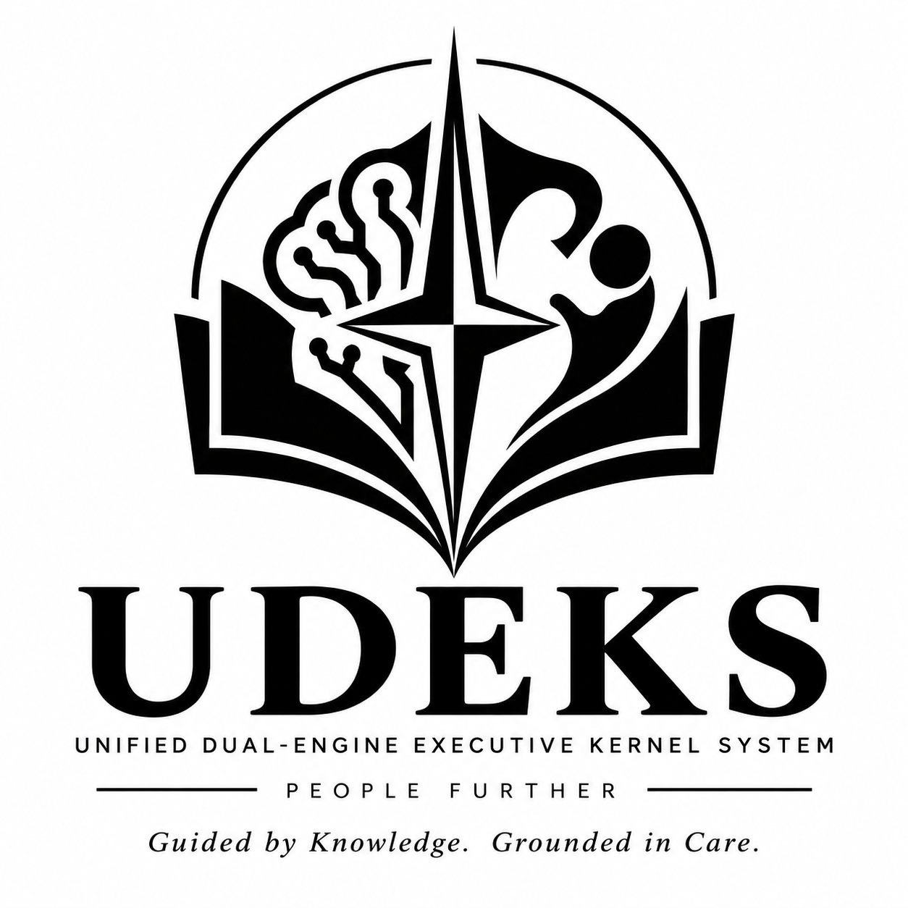

# UDEKS

<p align="center">
  
</p>

UDEKS—the **Unified Dual-Engine Executive Kernel System**—is a native operating
system for the Commodore 128. It is designed around the machine the C128 could
have been: a system that deliberately coordinates its 8502 and Z80 and treats
the VIC-IIe and VDC as independent, simultaneously useful display engines.

The name also echoes the Latin word *iudex*, “judge.” UDEKS is dedicated to
Lo Giudice, the teacher who introduced its creator to programming as a child
and embodied authority, knowledge, insight, firm direction, and paternal
sweetness. This project is developed in his memory. Read the full
[dedication](DEDICATION.md).

UDEKS is licensed under the GNU General Public License, version 3 or later.
See [LICENSE](LICENSE).

> [!IMPORTANT]
> UDEKS is in its architecture and bring-up phase. The current binaries are
> freestanding scaffolding, not a bootable or usable operating system.

## Hardware model

- The 8502 and Z80 share the system bus and do **not** execute concurrently;
  ownership passes explicitly between them.
- Which CPU runs the executive and which serves as the secondary execution
  engine is an open architecture decision, gated by comparative benchmarks on
  emulators and real hardware.
- The VDC is the primary high-resolution/text display engine.
- The VIC-IIe is a first-class secondary display and timing/sprite engine.
- A stock 128 KiB C128 with 16 KiB VDC RAM is the baseline. A 64 KiB VDC, REU,
  GeoRAM, and model-specific capabilities are optional enhancements.
- PAL and NTSC machines are both targets.

## Toolchain

| Side | C | Assembly and linking |
|---|---|---|
| 8502 | cc65 | ca65 and ld65 |
| Z80 | SDCC | sdasz80/sdld for C-linked code; RASM for standalone assembly |
| Host | host C/Python where useful | GNU Make |

The reference development environment is the `my-distrobox` Distrobox
container, but the build has no intentional dependency on Distrobox.

```sh
distrobox enter my-distrobox
make doctor
make check
make
```

`make doctor` currently expects `cc65`, `ca65`, `ld65`, `sdcc`, `sdasz80`,
`rasm`, and Python 3 on `PATH`. See the [building guide](docs/BUILDING.md) for
the validated reference environment and individual targets.

## Repository layout

```text
abi/                 Cross-CPU contracts and protocol documentation
bench/               Comparable target-side CPU benchmark harness
cfg/                 Linker and memory-layout configurations
docs/                Architecture plan, roadmap, and decisions
include/udeks/        Public C headers shared across CPU builds
mk/                   Make configuration
src/8502/             8502 C and ca65 sources
src/z80/              Z80 C, SDAS, and RASM sources
tests/                Host-side tests and future emulator tests
tools/                Deterministic build utilities
```

The provisional scaffold links both CPU images at `$2000`. This is only a
bring-up convention. The final boot and memory maps must be justified by
hardware tests and recorded as architecture decisions.

## Documents

- [Architecture and implementation plan](docs/PLAN.md)
- [Development roadmap](docs/ROADMAP.md)
- [Executive CPU benchmark plan](docs/BENCHMARKS.md)
- [Initial emulator benchmark results](bench/results/2026-09-24-1986-initial.md)
- [Initial emulator interrupt results](bench/results/2026-09-24-1986-irq-latency.md)
- [Initial emulator interrupt-service results](bench/results/2026-09-24-1986-irq-service.md)
- [Initial emulator context-switch results](bench/results/2026-09-24-1986-context.md)
- [Initial emulator kernel-primitives results](bench/results/2026-09-24-1986-kernel.md)
- [Initial emulator bidirectional-handoff results](bench/results/2026-09-24-1986-handoff.md)
- [Initial emulator offload-crossover results](bench/results/2026-09-24-1986-offload.md)
- [VICE 3.10 r2 benchmark results](bench/results/vice-3.10-2026-09-24-r2/README.md)
- [Corrected preserved benchmark PRGs for VICE and hardware](bench/artifacts/2026-09-24-r2/README.md)
- [Building UDEKS](docs/BUILDING.md)
- [Toolchain decision](docs/decisions/0001-toolchain.md)
- [Executive CPU decision](docs/decisions/0002-executive-cpu.md)
- [Mailbox ABI](abi/mailbox.md)
- [Dedication](DEDICATION.md)
- [Contributing](CONTRIBUTING.md)
