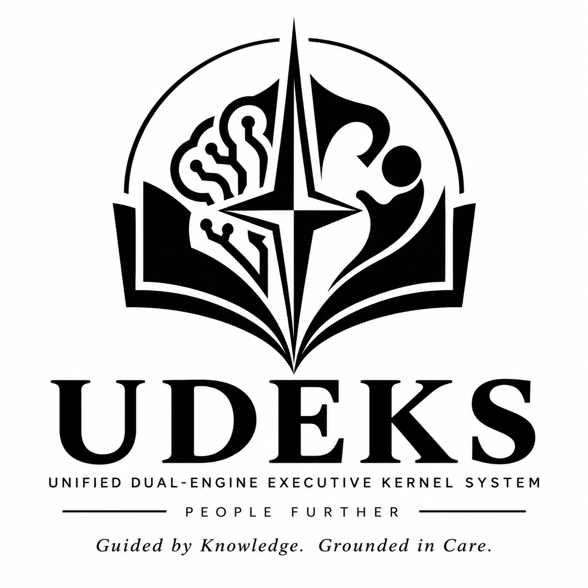
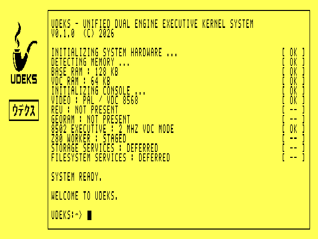
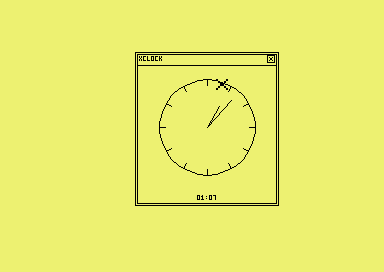
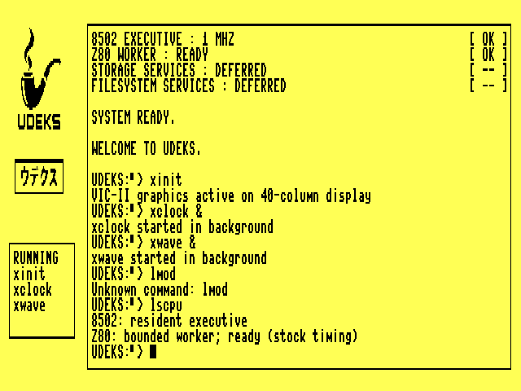
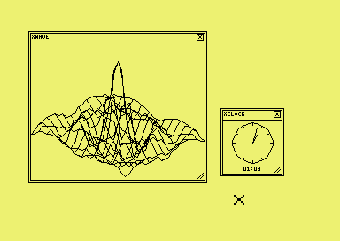
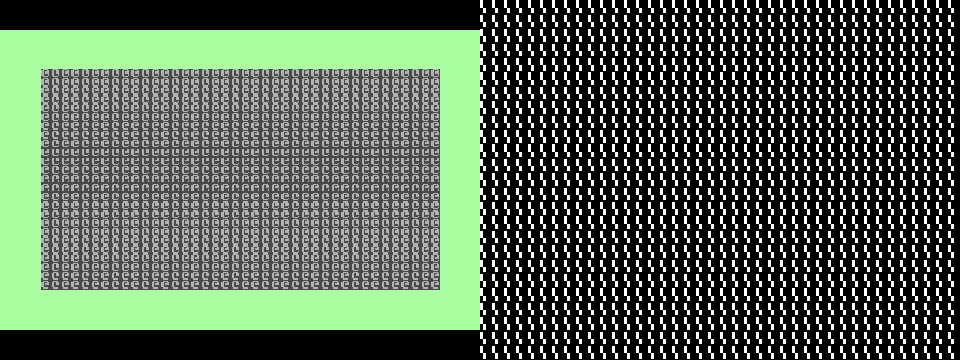

# UDEKS

<p align="center">
  
</p>

UDEKS—the **Unified Dual-Engine Executive Kernel System**—is a native operating
system for the Commodore 128. It is designed around the machine the C128 could
have been: a system that deliberately coordinates its 8502 and Z80 and treats
the VIC-IIe and VDC as independent, simultaneously useful display engines.
The Commodore 128 was among the earliest 8-bit home computers capable of a
multi-processor architecture and of driving more than one independent display
at the same time. UDEKS intends to build on those unusually forward-looking
capabilities instead of treating them as peripheral compatibility features.

The name also echoes the Latin word *iudex*, “judge.” UDEKS is dedicated to
“Professor Lo Giudice,” the teacher who introduced its creator to programming
as a child and embodied authority, knowledge, insight, firm direction, and
paternal sweetness. This project is developed in his memory. Read the full
[dedication](DEDICATION.md).

UDEKS is licensed under the GNU General Public License, version 3 or later.
See [LICENSE](LICENSE).

**[Roadmap](docs/ROADMAP.md):** accepted baseline — disk-backed `/` and coherent
`/bin`, `/etc`, `/mnt` routing ([#26](https://github.com/salvogendut/UDEKS/issues/26)).
Next: the first disk-loaded non-kernel service. General `.SH` execution is
deferred; the suffix is reserved, not a promise of POSIX/Bash compatibility.

> [!IMPORTANT]
> UDEKS is an experimental kernel prototype in active bring-up. It has a
> qualified native boot path, interactive console, dual-CPU worker protocol,
> and initial graphical applications, but it is not yet a general-purpose
> operating system: general filesystems, process
> isolation, and dynamic module loading remain future work.

<p align="center">
  
</p>

<p align="center">
  
</p>

<p align="center">
  
</p>

<p align="center">
  
</p>

<p align="center">
  
</p>

## Current prototype

- A native-autoboot D71 starts the assembly-oriented 8502 microkernel, its
  modular services, a loader-managed boot filesystem, and the stock-timing Z80
  worker. Standalone disk-only `xclock` and `xwave` UDEX images are loaded into
  retained application slots on first invocation. In the current root-namespace
  candidate, bootstrap mounts device 8 at `/`, then loads `/bin/ush` and
  `/etc/rc`; `/mnt` remains free for additional media.
- Boot messages reflect the measured hardware capabilities and Z80 state.
  The IEC-driver and bootfs lines check the loaded bank-1 headers; `[ -- ]`
  means that header did not match, not that the feature is deferred. These
  are presence/version checks, not full integrity or disk-access tests.
  An explicit data mount prints `mount: /mnt ready (read-only)` only after
  successfully reading the media. Secondary-load progress is visible on normal
  boot disks, matching the setting used in the successful C128/Pi1541 retest.
- The VDC hosts a retained black-on-yellow root console with mixed-case input,
  bounded command history, Unix-like standard streams, Bash-like command
  names, foreground `Ctrl+C`, and background jobs launched with `&`.
- The console's live `RUNNING` panel follows `xinit`, `xclock`, and `xwave`
  lifecycle changes.
- `xinit` owns an independent VIC-IIe bitmap desktop. A proportional 1351 mouse
  on port 1 and a digital joystick on port 2 drive its pointer. A raster-paced
  assembly input driver keeps mouse sampling independent of repaint and Z80
  latency.
- Window Manager 0.3 supports four overlapping, focused, movable, closable,
  and resizable bitmap windows. Dragging and resizing move an outline; clients
  repaint scaled content after release.
- `xclock` supplies the first C graphical client. `xwave` visibly divides work
  between the CPUs: the Z80 computes bounded rows of a radial sinc surface and
  the 8502 projects and draws its two-axis isometric wireframe. Computed heights
  are cached, so move and stacking repaints do not reacquire the Z80; resizing
  invalidates and recomputes the surface.
- The current statically linked services are transitional. ADR 0007 freezes a
  smaller resident-core boundary; new commands such as `cowsay` live under
  `user/` and must arrive through the executable-loader path.
- A transitional init service owns the root session. There is no resident
  command catalog. `ush` owns shell builtins and graphics command parsing;
  other names use the generic loader, searching system `/bin` only. Explicit
  data-volume paths work; data media never silently replace system commands.
  `cowsay`, `date`, `ls`, `cat`, `free`, `df` and the hardware/CPU diagnostics
  are ordinary disk programs. Normal bootfs retains only mount/unmount and
  recovery ush;
  `date` reads or sets the BASIC `TI`/`TI$`-compatible clock also used by
  `xclock`, while `ls`
  exercises the first Linux-shaped `open`/`getdents`/`stat`/`close` boundary.
  Init now first loads the ordinary disk file `USH.BIN` into bank 1, using the
  embedded `/bin/ush` as recovery. It runs through the public task/stream ABI,
  owns terminal lines, `cd`, `clear`, `echo`, `help` and `pwd`. Graphics and
  Z80 controls cross a bounded numeric service request, deferred until the
  bank-switched caller returns; CLI names/options/messages live outside the core.
  Task Request ABI 0.4 adds non-consuming stdin `POLL`: idle `ush` sleeps
  until a submitted line is readable. A compiled-C probe qualifies finite and
  infinite waits, wake/response ownership and stack preservation on both disk
  formats in VICE. Independent 1986 machine-input typing/history, dragging and
  foreground Ctrl+C also pass; manual input/performance and hardware gates remain open.
- The root-namespace candidate exposes flat CBM DOS files as virtual
  directories: `NAME.BIN` → `/bin/name`, `RC.ETC` → `/etc/rc`. `.SH` files also
  appear in `/bin`, but general script execution is still pending. No special
  disk format or per-app index is required. `cd`, `pwd`, `ls`, `cat` and `df`
  use the same service route; `mount 9 /mnt` adds raw data media without
  disrupting system commands. Storage remains read-only and single-stream,
  using native slow IEC with no runtime KERNAL calls. The prior command/graphics
  release was accepted on C128 + Pi1541; this namespace change needs a fresh
  hardware test. See the [current filesystem contract](abi/filesystem.md).
- Storage 0.2 adds explicit-path foreground execution: `/mnt/DISKCOW hello`
  loads an ordinary UDEX from disk, with bounds/header/EOF validation and
  bootfs fallback retained. VICE D64/D71 and native 1986 tests pass; the user
  also confirmed successful manual tests in 1986 and on a real C128 + PI1541.
  [Try the disk-execution image](docs/STORAGE-0.2.md#try-it).
- Disk-first boot retains bootfs recovery if the disk shell cannot load.
  Changing `USH.BIN` changes the shell; `RC.ETC` holds bounded ASCII startup
  commands. The default RC is comment-only because root already exists.
  Disk-loaded `free` reports the fixed task-memory pool; `df` defaults to `/`
  and `df /mnt` reports the separate data volume when mounted.
  [Test the root-namespace candidate](docs/BOOT-STARTUP.md#root-namespace-candidate-26).

## Hardware model

- The 8502 and Z80 share the system bus and do **not** execute concurrently;
  ownership passes explicitly between them.
- The 8502 runs the resident executive; the Z80 is a bounded secondary
  execution engine for workloads that demonstrate an end-to-end benefit.
- The resident kernel is a small assembly-oriented microkernel. I/O,
  filesystems, graphics, consoles, and other policy live in modular services
  written predominantly in C.
- The VDC is the primary high-resolution/text display engine.
- The VIC-IIe is a first-class secondary display and timing/sprite engine.
- A stock 128 KiB C128 with 16 KiB VDC RAM is the baseline. A 64 KiB VDC, REU,
  GeoRAM, and model-specific capabilities are optional enhancements.
- PAL and NTSC machines are both targets.

## Toolchain

| Side | C | Assembly and linking |
|---|---|---|
| 8502 | cc65 | ca65 and ld65 |
| Z80 | SDCC | sdasz80/sdld for C-linked code; RASM for standalone assembly |
| Host | host C/Python where useful | GNU Make |

The reference development environment is the `my-distrobox` Distrobox
container, but the build has no intentional dependency on Distrobox.

```sh
distrobox enter my-distrobox
make doctor
make check
make
```

`make doctor` currently expects `cc65`, `ca65`, `ld65`, `sdcc`, `sdasz80`,
`rasm`, and Python 3 on `PATH`. See the [building guide](docs/BUILDING.md) for
the validated reference environment and individual targets.

## Repository layout

```text
abi/                 Cross-CPU contracts and protocol documentation
bench/               Comparable target-side CPU benchmark harness
cfg/                 Linker and memory-layout configurations
docs/                Architecture plan, roadmap, and decisions
include/udeks/        Public C headers shared across CPU builds
mk/                   Make configuration
src/8502/             8502 C and ca65 sources
src/apps/             Standalone graphical UDEX application sources
src/boot/             Native C128 stage-0/stage-1 bootstrap
src/kernel/           Executive and service-registry core
src/services/         Predominantly C system-service modules
src/z80/              Z80 C, SDAS, and RASM sources
tests/                Host-side tests and future emulator tests
tools/                Deterministic build utilities
user/                 Standalone program sources and user-side ABI headers
```

`make boot` produces native-autoboot D64/D71 images with the resident 8502
kernel, Z80 worker, transitional service bundle, recovery bootfs, and a
standalone `USH.BIN` disk file. Init establishes the system root and loads that
shell into bank 1 before starting its task and running `/etc/rc` (`RC.ETC`).
Foreground names resolve from system `/bin`; explicit `/mnt/NAME` works on a
mounted data volume. Bootfs is reserved for recovery, not normal command search.
Disk utilities such as `ls`, `date` and `uname` work immediately after boot. Likewise,
`xclock &` and `xwave &` load the graphical UDEX files into retained slots;
there are no normal bootfs copies of either app. See
[disk-loaded graphics](docs/DISK-GRAPHICS.md) for testing and limits.
General task allocation and extracting the
remaining non-kernel services are still roadmap work.
See [command extraction and the current test sequence](docs/COMMAND-EXTRACTION.md)
for the disk/shell/recovery inventory. This is not yet kernel-only boot.

The generic retained-window cache is enabled by default in `make boot`, following
emulator qualification and real-hardware input/RESTORE acceptance. The prior
compositor remains available with `make WINDOW_CACHE=0 boot`. Release repaint
can still take seconds. See the [integration and testing guide](docs/WINDOW-CACHE-INTEGRATION.md).

## Documents

- [Architecture and implementation plan](docs/PLAN.md)
- [Scheduler placement spike](docs/SCHEDULER-PLACEMENT.md)
- [Development roadmap](docs/ROADMAP.md)
- [Executive CPU benchmark plan](docs/BENCHMARKS.md)
- [Initial emulator benchmark results](bench/results/2026-09-24-1986-initial.md)
- [Initial emulator interrupt results](bench/results/2026-09-24-1986-irq-latency.md)
- [Initial emulator interrupt-service results](bench/results/2026-09-24-1986-irq-service.md)
- [Initial emulator context-switch results](bench/results/2026-09-24-1986-context.md)
- [Initial emulator kernel-primitives results](bench/results/2026-09-24-1986-kernel.md)
- [Initial emulator bidirectional-handoff results](bench/results/2026-09-24-1986-handoff.md)
- [Initial emulator offload-crossover results](bench/results/2026-09-24-1986-offload.md)
- [`1986` r2 benchmark results](bench/results/1986-7556c23-2026-09-24-r2/README.md)
- [VICE 3.10 r2 benchmark results](bench/results/vice-3.10-2026-09-24-r2/README.md)
- [Native memory-map direct-load smoke test](bench/results/2026-09-24-memory-map-smoke/README.md)
- [Native D71 boot results](bench/results/2026-09-24-native-boot/README.md)
- [VDC console service](docs/VDC-CONSOLE.md)
- [Assembly panic path](docs/PANIC.md)
- [Hardware capability discovery](docs/HARDWARE-CAPABILITIES.md)
- [8502 clock policy](docs/CLOCK.md)
- [Proposed VDC framebuffer/compositor](docs/VDC-FRAMEBUFFER.md)
- [Window system and native console plan](docs/WINDOW-SYSTEM.md)
- [Black-on-yellow visual identity](docs/VISUAL-IDENTITY.md)
- [VDC console qualification](bench/results/2026-09-24-vdc-console/README.md)
- [Service-registry qualification](bench/results/2026-09-24-service-registry/README.md)
- [Assembly panic-path qualification](bench/results/2026-09-24-panic/README.md)
- [Hardware-capability qualification](bench/results/2026-09-24-capabilities/README.md)
- [VDC framebuffer and boot-splash qualification](bench/results/2026-09-24-vdc-framebuffer/README.md)
- [VDC software-font and hardware-panel qualification](bench/results/2026-09-24-vdc-font/README.md)
- [Compact pipe-logo bootsplash qualification](bench/results/2026-09-24-vdc-pipe-logo/README.md)
- [Backed framebuffer API and console-viewport qualification](bench/results/2026-09-24-framebuffer-api/README.md)
- [Reference-style UDEKS bootscreen qualification](bench/results/2026-09-24-reference-bootscreen/README.md)
- [Retained root-console qualification](bench/results/2026-09-24-root-console/README.md)
- [VDC-only 2 MHz qualification and timing](bench/results/2026-09-24-clock-2mhz/README.md)
- [Corrected preserved benchmark PRGs for VICE and hardware](bench/artifacts/2026-09-24-r2/README.md)
- [Building UDEKS](docs/BUILDING.md)
- [Toolchain decision](docs/decisions/0001-toolchain.md)
- [Executive CPU decision](docs/decisions/0002-executive-cpu.md)
- [Proposed native memory and bootstrap contract](docs/decisions/0003-memory-bootstrap.md)
- [Microkernel and service-module decision](docs/decisions/0004-microkernel-modules.md)
- [Root-console and overlapping-window decision](docs/decisions/0005-root-window-and-compositor.md)
- [Text-console and 1 MHz boot decision](docs/decisions/0006-text-console-default.md)
- [Resident core and loadable service decision](docs/decisions/0007-resident-core-and-loadable-services.md)
- [Context-switch placement decision](docs/decisions/0008-context-switch-placement.md)
- [Boot-only capability relocation decision](docs/decisions/0009-boot-only-capability-relocation.md)
- [Boot-console relocation decision](docs/decisions/0010-boot-console-relocation.md)
- [Boot-delivery shadow-execution decision](docs/decisions/0011-boot-delivery-shadow-execution.md)
- [Mailbox ABI](abi/mailbox.md)
- [Task lifecycle ABI](abi/tasks.md)
- [UDEX executable format](abi/executable.md)
- [Read-only boot filesystem format](abi/bootfs.md)
- [Filesystem and Unix-like command direction](abi/filesystem.md)
- [8502 syscall and program-entry ABI](abi/syscalls.md)
- [Bank-1 8502 cooperative-task gate](abi/task-bank.md)
- [Bank-task request and stream ABI](abi/task-request.md)
- [Bounded Z80 worker service](abi/z80-worker.md)
- [VIC-IIe graphics service](abi/vic-graphics.md)
- [VIC-IIe window manager](abi/window.md)
- [Pointer input service](abi/pointer-input.md)
- [CIA time service](abi/time.md)
- [`date` and the shared C128 clock](docs/DATE.md)
- [`xclock` analog clock application](docs/XCLOCK.md)
- [`xwave` dual-engine graphics demo](docs/XWAVE.md)
- [`cowsay` first user-program port](docs/COWSAY.md)
- [`/bin/ush` user-shell migration](docs/USH.md)
- [Planned `xmandel` dual-engine Mandelbrot viewer](docs/XMANDEL.md)
- [Service-module ABI](abi/services.md)
- [Framebuffer client API](abi/framebuffer.md)
- [Retained terminal API](abi/terminal.md)
- [C128 keyboard API](abi/keyboard.md)
- [Root-terminal line editor API](abi/line-editor.md)
- [Native shell contract](abi/shell.md)
- [Standard stream interface](include/udeks/stream.h)
- [Dedication](DEDICATION.md)
- [Contributing](CONTRIBUTING.md)
