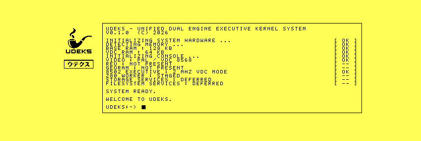

# Atomic framebuffer qualification

The production boot renderer now prepares the complete VDC bitmap in its
16,000-byte system-RAM surface before beginning one auto-incrementing assembly
transfer. VDC register 6 is set to zero before display memory is touched, so
border construction, text rendering, and upload are hidden. The completed
black-on-yellow bitmap is revealed only after the transfer and splash
readback succeed.

The four format-8 records under `raw/` reached ready state with flags `$3F`:

| Emulator | VDC RAM | Splash sum | Root-model sum |
|---|---:|---:|---:|
| VICE 3.10 | 64 KiB | `$5873` | `$6A1A` |
| VICE 3.10, revision 1 | 16 KiB | `$5873` | `$6A12` |
| `1986` `7556c2357506dc576ab7ab0783f9971892db1450` | 64 KiB | `$5873` | `$6A1A` |
| `1986` `7556c2357506dc576ab7ab0783f9971892db1450` | 16 KiB | `$5873` | `$6A17` |

The root-model checksum covers retained boot text, so the value legitimately
changes when detected VDC revision and memory descriptions change. The splash
checksum and rendered layout remain common.



## `1986` timing

Default 64 KiB cold boots were run without throttling. The preserved records
bracket `VFBR` state byte `$F0E5`:

| Renderer | Last starting | First ready |
|---|---:|---:|
| Original 1 MHz path | frame 1547 | frame 1552 |
| Verified 2 MHz path | frame 1025 | frame 1038 |
| Atomic assembly path | frame 645 | frame 650 |

The atomic path is ready 388 frames before the earlier 2 MHz path and 902
frames before the 1 MHz path: reductions of about 37% and 58% respectively in
the measured cold-boot interval. At PAL's 50 frames per second those deltas
are 7.76 and 18.04 seconds. The timing includes disk loading and hardware
discovery, not just rendering.

The exact boot image is preserved under
[`bench/artifacts/2026-09-24-atomic-framebuffer-r1`](../../artifacts/2026-09-24-atomic-framebuffer-r1/README.md).
Physical C128 verification remains required.

```sh
python3 tools/framebuffer_decode.py raw/vice-64.bin
python3 tools/framebuffer_decode.py raw/1986-16.bin
cd raw && sha256sum -c SHA256SUMS
cd ../timing && sha256sum -c SHA256SUMS
```
