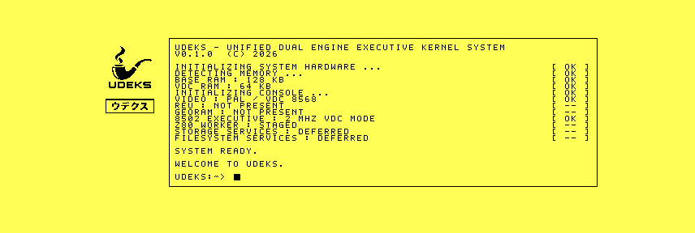

# VDC-only 2 MHz qualification

UDEKS now completes VIC-based PAL/NTSC discovery at the inherited 1 MHz rate,
then starts a critical machine-clock service before either display service. The
service blanks the VIC, clears its test bit, selects 2 MHz, verifies both
registers, and publishes `CLK2` at `$F100`.

VICE 3.10 and `1986` commit
`7556c2357506dc576ab7ab0783f9971892db1450` produced the same clock record on
16 KiB and 64 KiB VDC configurations:

```text
$D030: $FC -> $FD
$D011: $1B -> $0B
flags: $07 (capability ready, VIC blanked, fast readback)
```

All four completed framebuffer records also agree byte-for-byte between the
emulators for corresponding VDC tiers. The visible console identifies the
active `2 MHZ VDC MODE`.



## `1986` before/after timing

The same default 64 KiB configuration was cold-booted from the preserved 1 MHz
and 2 MHz D71 images with throttling disabled. Snapshots bracket the transition
of `VFBR` state byte `$F0E5` from starting (`1`) to ready (`2`):

| Image | Last observed starting | First observed ready |
|---|---:|---:|
| 1 MHz | frame 1547 | frame 1552 |
| 2 MHz | frame 1025 | frame 1038 |

The new image is therefore visibly complete at least 509 frames before the old
image could be complete. At PAL's 50 frames per second that is at least 10.18
seconds, reducing the measured cold-boot-to-framebuffer interval by about one
third. Disk loading and initial VIC-based probing remain at 1 MHz; the gain is
from the subsequent console and framebuffer work.

The exact comparison images are preserved under
[`bench/artifacts/2026-09-24-clock-2mhz-r1`](../../artifacts/2026-09-24-clock-2mhz-r1/README.md).
Physical C128 verification remains required.

```sh
python3 tools/clock_decode.py raw/clock-vice-64.bin
python3 tools/clock_decode.py raw/clock-1986-64.bin
python3 tools/framebuffer_decode.py raw/framebuffer-vice-16.bin
cd raw && sha256sum -c SHA256SUMS
cd ../timing && sha256sum -c SHA256SUMS
```
