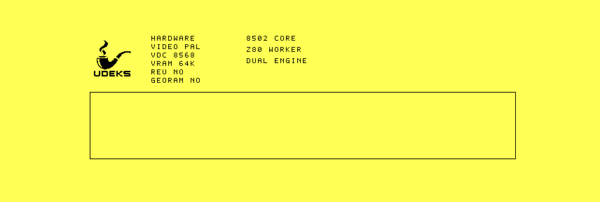

# Backed framebuffer API and console-viewport qualification

The preserved production D71 was cold-booted under VICE 3.10 and `1986`
commit `7556c2357506dc576ab7ab0783f9971892db1450`, each with 16 KiB and
64 KiB VDC RAM. The 1986 completion window was raised from 900 to 1,200
frames to cover the additional verified graphics flush.

The framebuffer now owns a 16,000-byte system-RAM backing surface and a
2,000-byte dirty bitmap capable of retaining disjoint byte spans on each
scanline. Its first single-client lease exposes pixel, horizontal-span,
clipped filled-rectangle, glyph, string, and verified-flush operations.

The boot composition exercises the public API rather than a private drawing
shortcut: it acquires the framebuffer, renders the hardware header to the
right of the pipe, draws a 608x96 future console viewport with span and
rectangle calls, flushes and reads back every dirty byte, then releases the
lease. The resulting VDC screen is preserved as `vice-vdc.png`.



All four runs reached `VFBR` format 5 ready state with display flags `$7F` and
graphics API flags `$1F`. VICE and `1986` produced byte-identical records for
corresponding memory tiers. The exact D71 is preserved under
[`bench/artifacts/2026-09-24-framebuffer-api-r1`](../../artifacts/2026-09-24-framebuffer-api-r1/README.md).
Real C128 RGBI output remains a qualification gate.

```sh
python3 tools/framebuffer_decode.py raw/vice-64.bin
python3 tools/framebuffer_decode.py raw/vice-16.bin
python3 tools/framebuffer_decode.py raw/1986-64.bin
python3 tools/framebuffer_decode.py raw/1986-16.bin
cd raw && sha256sum -c SHA256SUMS
```
