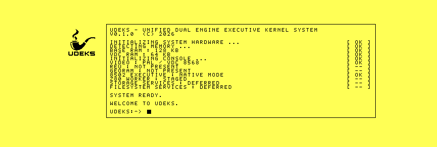

# Reference-style UDEKS bootscreen qualification

The preserved production D71 was cold-booted under VICE 3.10 and `1986`
commit `7556c2357506dc576ab7ab0783f9971892db1450`, each with 16 KiB and
64 KiB VDC RAM. The denser 17-line screen completes inside a 1,600-frame
1986 qualification window.

The native 640x200 VDC composition adapts `assets/bootscreen.png` rather than
scaling it. The 64x64 pipe occupies a left rail. A 528x184 frame at the right
contains the UDEKS name and version, truthful hardware results, aligned
`[ OK ]` and `[ -- ]` fields, explicit deferrals for unimplemented storage and
filesystem services, a welcome line, and a static future-shell prompt/cursor.
The font now includes the punctuation required by the console design and maps
lowercase input to its uppercase bring-up glyphs.



All four runs reached `VFBR` format 6 ready state with 17 rendered lines,
display flags `$7F`, and graphics API flags `$1F`. VICE and `1986` produced
byte-identical records for corresponding memory tiers. The exact D71 is
preserved under
[`bench/artifacts/2026-09-24-reference-bootscreen-r1`](../../artifacts/2026-09-24-reference-bootscreen-r1/README.md).
Real C128 RGBI output remains a qualification gate.

```sh
python3 tools/framebuffer_decode.py raw/vice-64.bin
python3 tools/framebuffer_decode.py raw/vice-16.bin
python3 tools/framebuffer_decode.py raw/1986-64.bin
python3 tools/framebuffer_decode.py raw/1986-16.bin
cd raw && sha256sum -c SHA256SUMS
```
