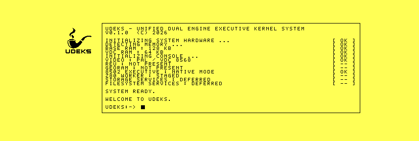

# Retained root-console qualification

The preserved production D71 was cold-booted under VICE 3.10 and `1986`
commit `7556c2357506dc576ab7ab0783f9971892db1450`, each with 16 KiB and
64 KiB VDC RAM. All four runs reached the completed state within a
1,800-frame qualification window.

The bordered boot area is now backed by a retained 64x21 character grid and
cursor state. Boot-message construction no longer belongs to the VDC backend:
the boot-console producer populates the model, and the framebuffer service
renders that model at the existing viewport. The resulting composition remains
visually unchanged.



All runs produced `VFBR` format 7 with 17 populated lines, display flags
`$7F`, and graphics API flags `$3F`. Bit `$20` records the retained-text
capability. VICE and `1986` produced byte-identical records for corresponding
VDC memory tiers. The exact D71 is preserved under
[`bench/artifacts/2026-09-24-root-console-r1`](../../artifacts/2026-09-24-root-console-r1/README.md).
Real C128 RGBI output remains a qualification gate.

```sh
python3 tools/framebuffer_decode.py raw/vice-64.bin
python3 tools/framebuffer_decode.py raw/vice-16.bin
python3 tools/framebuffer_decode.py raw/1986-64.bin
python3 tools/framebuffer_decode.py raw/1986-16.bin
cd raw && sha256sum -c SHA256SUMS
```
