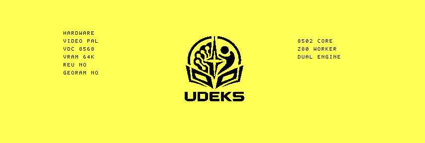

# VDC software-font and hardware-panel qualification

The preserved production D71 was cold-booted under VICE 3.10 and `1986`
commit `7556c2357506dc576ab7ab0783f9971892db1450`, each with 16 KiB and
64 KiB VDC RAM.

The original UDEKS 5x7 uppercase font renders in 8x8 cells around the centred
boot logo. The panel consumes the existing `HCAP` record and displays:

- PAL or NTSC video standard;
- 8563 or 8568 VDC family;
- 16K or 64K VDC RAM;
- REU and GeoRAM presence;
- the resident 8502 executive and Z80 worker roles.

Every font scanline was written and immediately read back through the bounded
VDC transport. The 64K panel has checksum `$1490`; the 16K panel has `$13C8`
because its `VRAM` line differs. VICE and `1986` produced byte-identical records
for corresponding tiers. `vice-vdc.png` is the final VICE VDC-canvas capture.



The exact D71 is preserved under
[`bench/artifacts/2026-09-24-vdc-font-r1`](../../artifacts/2026-09-24-vdc-font-r1/README.md).
Real C128 RGBI output remains a qualification gate.

```sh
python3 tools/framebuffer_decode.py raw/vice-64.bin
python3 tools/framebuffer_decode.py raw/vice-16.bin
python3 tools/framebuffer_decode.py raw/1986-64.bin
python3 tools/framebuffer_decode.py raw/1986-16.bin
cd raw && sha256sum -c SHA256SUMS
```
