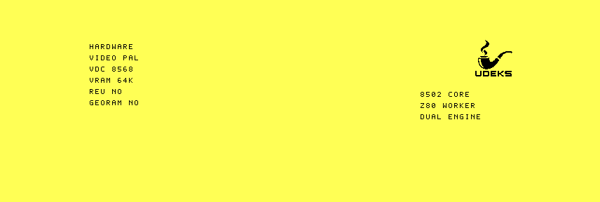

# Compact pipe-logo bootsplash qualification

The preserved production D71 was cold-booted under VICE 3.10 and `1986`
commit `7556c2357506dc576ab7ab0783f9971892db1450`, each with 16 KiB and
64 KiB VDC RAM.

The build converts `assets/udekspipe-64.xpm` into a 512-byte, one-bit VDC
bitmap. The framebuffer places the 64x64 pipe at x=560, y=12, leaving a
16-pixel right margin. The 8502/Z80 role block was moved below the mark so the
software-font hardware panel does not overlap it.

All four runs reached `VFBR` format 3 ready state with flags `$7F`. Each run
read back the complete logo and produced byte-sum `$5873` at VDC address
`$0406`. VICE and `1986` produced byte-identical records for corresponding
memory tiers. `vice-vdc.png` is the final VICE VDC-canvas capture.



The exact D71 is preserved under
[`bench/artifacts/2026-09-24-vdc-pipe-logo-r1`](../../artifacts/2026-09-24-vdc-pipe-logo-r1/README.md).
Real C128 RGBI output remains a qualification gate.

```sh
python3 tools/framebuffer_decode.py raw/vice-64.bin
python3 tools/framebuffer_decode.py raw/vice-16.bin
python3 tools/framebuffer_decode.py raw/1986-64.bin
python3 tools/framebuffer_decode.py raw/1986-16.bin
cd raw && sha256sum -c SHA256SUMS
```
